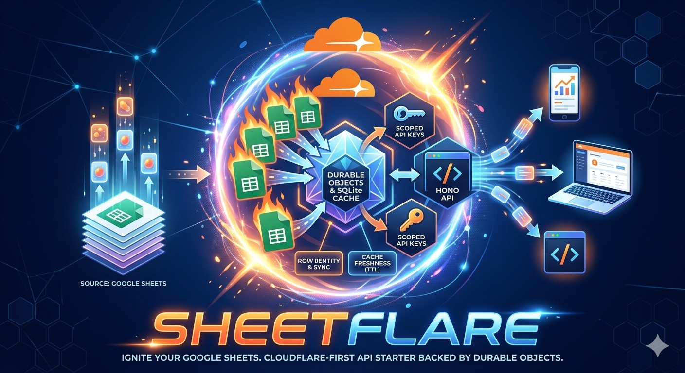

# Sheetflare



Sheetflare is a Cloudflare-first starter for exposing Google Sheets tabs through a small Hono API backed by Durable Objects.
It is aimed at controlled self-hosted deployments and is not yet production-proven for broad external workloads.

Production hardening guidance lives in [production-readiness-checklist.md](./production-readiness-checklist.md).
Start with [docs/quickstart.md](./docs/quickstart.md).
Operational docs live in [docs/operator-runbook.md](./docs/operator-runbook.md) and [docs/deploy.md](./docs/deploy.md).
Google credential setup guidance lives in [docs/google-service-accounts.md](./docs/google-service-accounts.md).
Production evidence workflows live in [docs/benchmarking.md](./docs/benchmarking.md) and [docs/observability.md](./docs/observability.md).
Project policies live in [LICENSE](./LICENSE), [SECURITY.md](./SECURITY.md), [CONTRIBUTING.md](./CONTRIBUTING.md), and [CODE_OF_CONDUCT.md](./CODE_OF_CONDUCT.md).

## Workspaces

- `apps/api`: Cloudflare Worker API and Durable Object entrypoints
- `apps/admin`: lightweight React admin UI
- `packages/contracts`: shared request, response, RPC, and error contracts
- `packages/domain`: pure row, pagination, and schema utilities
- `packages/google-sheets`: Google Sheets service-account client
- `packages/cloudflare`: Durable Object implementations and RPC helpers

## Commands

```powershell
npm install
npm run check
npm run setup
npm run dev:api
npm run dev:admin
npm run deploy
npm run e2e:local
npm run smoke
```

## Operator Scripts

- `npm run setup`
- `npm run ops:create-admin-key`
- `npm run ops:bootstrap`
- `npm run ops:cache`
- `npm run ops:cache:health`
- `npm run ops:reindex`
- `npm run e2e:browser`
- `npm run e2e:local`
- `npm run deploy`
- `npm run smoke`
- `npm run load`

## Setup Path

For the normal setup flow:

1. Follow [docs/quickstart.md](./docs/quickstart.md).
2. Run `npm run setup`.
3. Use [docs/google-service-accounts.md](./docs/google-service-accounts.md) only if you still need help provisioning the Google service account itself.
4. Use [docs/deploy.md](./docs/deploy.md) for CI deployment details, manual fallback commands, and Cloudflare token scopes.
5. Use [docs/operator-runbook.md](./docs/operator-runbook.md) for day-2 operations and failure handling.

`npm run setup` writes `sheetflare.setup.json`, keeps reusable local secret state in `.sheetflare.setup.local.json`, can apply secrets, can deploy, can bootstrap the first project and keys, and can run smoke validation. The local state file is secret material, stays untracked, and should not be shared. For reruns from an existing config:

- `npm run setup -- --apply-secrets`
- `npm run setup -- --deploy`
- `npm run setup -- --bootstrap`
- `npm run setup -- --smoke`

If you are maintaining this repository's own shared staging environment, use [docs/contributor-staging.md](./docs/contributor-staging.md).

## API Docs

When the API worker is running:

- `GET /doc` returns the generated OpenAPI document.
- `GET /docs` serves the interactive API reference UI.

The docs reflect the actual HTTP surface, including auth requirements, path params, query params, and request/response bodies for the supported endpoints.
Admin project and table POST routes create by default. Replacing an existing config requires an explicit `?upsert=true`.

## Auth Model

- Admin routes use either the bootstrap bearer token or an API key with the relevant admin scope.
- Data routes use scoped API keys unless the project is configured with `defaultAuthMode: "public-read"`.
- API keys are stored in the control-plane durable object with hashed secrets, revocation timestamps, and last-used timestamps.
- Supported scopes are intentionally small and exact:
  - `admin:projects`
  - `admin:keys`
  - `table:read`
  - `table:create`
  - `table:update`
  - `table:delete`

Bootstrap and deployment steps are documented in [docs/quickstart.md](./docs/quickstart.md).

## Row Identity

- Managed tables require a stable ID column.
- Header rows must not contain duplicate non-empty column names.
- Table config can mark specific columns as read-only with `readOnlyFields`.
- Table config can also define write-time `fieldRules` such as `required`, `unique`, `enum`, `normalize`, and `type`.
- The gateway treats row numbers as a cache only.
- Row creation rejects duplicate managed IDs.
- Updates and deletes re-resolve rows by ID before mutating the sheet, which keeps the system correct when rows are re-ordered manually in Google Sheets.
- Mutation lookup uses a narrow scan of the managed ID column plus targeted row reads instead of rescanning full row payloads, which reduces write-path cost on larger sheets while preserving correctness.
- Read-only columns are never targeted by API writes, which lets a sheet expose formula-derived or operator-managed values without API updates flattening them.
- `fieldRules` are enforced on API writes. They do not prevent direct Google Sheets edits from introducing invalid or duplicate values later.

## Cache And Sync

- Each table durable object maintains a materialized row cache in Durable Object SQLite.
- Normal reads (`list`, `get`, `schema`) use cached rows instead of rescanning Google Sheets.
- Cache freshness is controlled by `cacheTtlSeconds` on the table config.
- Table layout must be explicit and valid: `dataStartRow` must be greater than `headerRow`.
- When the cache is cold or stale, the table durable object performs a sync from Google Sheets and refreshes:
  - cached rows
  - row ID to row number index
  - cached headers
  - sync metadata
- Writes update the cache immediately after successful upstream mutation.
- Deletes normally repair cached row numbers through a narrow managed-ID scan instead of forcing a full row-data resync.
- If the post-delete row reference scan does not match the local cache shape, the table falls back to a full sync for safety.
- Table config changes that affect cache shape, indexing, or sheet layout automatically mark the cache stale and force a resync on the next read or write.

Operational procedures for reindex, cache inspection, and failure handling live in [docs/operator-runbook.md](./docs/operator-runbook.md).

## Initial Envelope

These are conservative starting constraints, not benchmark-proven public limits:

- one `TableDO` owns one table, so each hot table is effectively single-threaded at the Durable Object boundary
- `TABLE_MAX_FULL_SCAN_ROWS` defaults to `10000`
- scan-heavy operators like `contains` should stay off the hot path for public workloads
- keep `cacheTtlSeconds` in the `15` to `60` second range until staging data proves a better setting
- keep indexed fields lean even though the hard limit is `32` including the managed ID column

Use [docs/benchmarking.md](./docs/benchmarking.md) to replace these starting assumptions with measured limits from your own staging deployment.

## Query Semantics

- Filters are AND-only across fields.
- Sort supports one field at a time, plus stable keyset pagination cursors.
- Efficient queries are expected to use indexed fields.
- Every table automatically indexes its ID column.
- Additional indexed fields are declared in table config with `indexedFields`.

Supported filter operators:

- `eq`
- `neq`
- `gt`
- `gte`
- `lt`
- `lte`
- `in`
- `startsWith`
- `contains`
- `isNull`

HTTP note:

- `GET /v1/projects/:project/tables/:table/rows` accepts `filter` as a JSON-encoded query parameter.
- Example:
  `?filter={"status":{"eq":"active"},"score":{"gte":80}}`

Performance notes:

- Equality, range, `in`, and indexed sort retrieval use SQLite-backed cached cell indexes.
- `contains` is supported, but it is scan-heavy. For safety, scan-heavy queries are rejected once a cached table grows beyond the configured full-scan threshold.
- If a filter or sort targets a non-indexed field, the API rejects it instead of silently doing an expensive query on large caches.
- Mutation note: the write path is optimized separately from list/query execution. Update/delete/create-duplicate checks resolve IDs through the managed ID column, not through the cached query indexes.
- The Worker env var `TABLE_MAX_FULL_SCAN_ROWS` controls that threshold and defaults to `10000`.

## Admin UI

- The admin UI now supports the minimum real control-plane loop:
  - create projects
  - create tables
  - create scoped API keys
  - list global and project-scoped keys
  - revoke keys with visible active/revoked state
  - validate project/table/key drafts before submit
  - refresh project and key views explicitly
  - inspect cache status
  - force reindex
- Table creation now supports `readOnlyFields` for columns that should stay sheet-managed.
- Table creation also supports optional `fieldRules` for required, unique, enum, normalize, and type validation.
- Credential persistence is opt-in for scoped admin API keys only. Bootstrap admin tokens stay session-only.
- Paste either the bootstrap admin token or a scoped admin API key into the auth panel, but prefer scoped keys for routine admin use.

## Notes

- Project listing and API keys are handled by a dedicated `ControlPlaneDO`.
- The Google Sheets adapter uses service-account JWT exchange and the Sheets REST API directly, so the worker does not depend on Node-only Google SDKs.
- Google Sheets read paths use bounded retry/backoff for transient upstream failures, while mutation paths avoid automatic replay to reduce duplicate-write risk.
- Non-timeout transport failures are reported distinctly from actual request timeouts.
- Rate limits are bucketed by route family and operation key, for example `admin.projects.list`, `rows.list`, and `admin.cache.reindex`, so hot endpoints do not starve unrelated calls from the same principal.
- Rate-limit principals are derived only from verified credentials; unverified API-key-shaped strings fall back to the anonymous/IP bucket.
- `npm run build`, `npm run typecheck`, and `npm test` all pass from the repo root.

## Local End-To-End Checks

Once you have live Google Sheets credentials and the smoke-test projects/tables configured:

Required smoke env vars:

- `SHEETFLARE_ADMIN_CREDENTIAL`
- `SHEETFLARE_PRIVATE_PROJECT`
- `SHEETFLARE_PRIVATE_TABLE`
- `SHEETFLARE_PRIVATE_READ_KEY`
- `SHEETFLARE_MUTATION_KEY`
- `SHEETFLARE_SMOKE_CREATE_VALUES_JSON`
- `SHEETFLARE_SMOKE_UPDATE_VALUES_JSON`

Optional for anonymous `public-read` coverage:

- `SHEETFLARE_PUBLIC_PROJECT`
- `SHEETFLARE_PUBLIC_TABLE`

```powershell
npx playwright install chromium
npm run e2e:local
```

`npm run e2e:local` starts the local API and admin UI, runs the API smoke checks against the local Worker, then runs browser automation against the admin UI.
