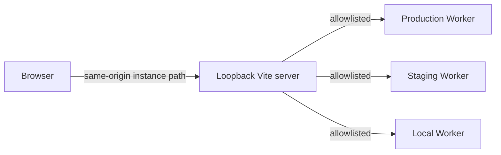

# Multi-Instance Local Admin Plan

## Goal

Let one loopback-only Sheetflare admin process manage multiple independent Sheetflare Worker deployments safely.

A deployment is an **instance**. Projects and tables inside one Worker remain resources within that instance.

The design keeps the current boundary intact:

- the browser talks only to the loopback Vite server;
- Vite routes only to configured upstreams;
- the browser selects an instance ID, never an arbitrary URL;
- credentials stay in memory and belong to one instance;
- the UI verifies the remote identity before sending a credential;
- the active instance remains visible during every operation.

## Current limitation

The admin currently assumes one instance:

- `apps/admin/vite.config.ts` resolves one API target at startup;
- `apps/admin/src/api.ts` calls unscoped relative paths;
- `apps/admin/src/app.tsx` owns one credential and one set of resource state.

Adding only a target dropdown would be unsafe. A credential or selected project could survive a target change, and a mislabeled URL could send a production mutation to the wrong deployment.

## Target architecture



Browser requests use a reserved local namespace:

```text
/_sheetflare/instances/{instanceId}/v1/...
/_sheetflare/instances/{instanceId}/health
/_sheetflare/instances/{instanceId}/ready
```

Vite maps the validated ID to one fixed upstream and removes the local prefix before forwarding:

```text
/_sheetflare/instances/acme-production/v1/admin/projects
    -> https://api.example.com/v1/admin/projects
```

The browser never supplies routing authority beyond the allowlisted instance ID.

## Design decisions

### 1. One stable identity per deployment

Add an explicit instance identity to setup configuration:

```json
{
  "instance": {
    "id": "acme-production",
    "name": "Production"
  },
  "profile": "production"
}
```

`instance.id` is a stable lowercase slug. It identifies the deployment in setup, the Worker, the local registry, proxy routes, logs, and browser state. Do not introduce separate local and remote IDs.

`profile` continues to select the setup/deployment configuration. The Worker reports an `environment` identity derived from that profile; local Wrangler development reports `development`.

Extend `/ready` with non-secret identity:

```json
{
  "status": "ready",
  "instance": {
    "id": "acme-production",
    "name": "Production",
    "environment": "production"
  },
  "checks": {}
}
```

Before enabling credential entry, the UI verifies that the configured ID and environment match `/ready`. A mismatch blocks all authenticated requests with no bypass.

The identity response must not expose account IDs, bindings, Durable Object names, credentials, or other internal configuration.

### 2. Explicit local registry

Add a gitignored `.sheetflare.admin.local.json`:

```json
{
  "schemaVersion": 1,
  "instances": [
    {
      "id": "acme-production",
      "name": "Production",
      "environment": "production",
      "apiUrl": "https://api.example.com"
    },
    {
      "id": "acme-staging",
      "name": "Staging",
      "environment": "staging",
      "apiUrl": "https://staging-api.example.com"
    },
    {
      "id": "local",
      "name": "Local Development",
      "environment": "development",
      "apiUrl": "http://127.0.0.1:8787"
    }
  ]
}
```

Parse it with a strict Zod 4 schema. Reject:

- unsupported schema versions or unknown fields;
- duplicate IDs or canonical URLs;
- malformed IDs;
- remote HTTP targets;
- URL credentials, query strings, or fragments;
- an empty registry;
- invalid fixed base paths.

HTTP remains loopback-only. Remote targets require HTTPS. A malformed registry fails startup; Vite must not silently skip entries.

The registry contains URLs and labels only. It never stores API keys, bootstrap tokens, Cloudflare tokens, or Google credentials.

When the registry is absent, preserve the current single-instance resolution:

1. `SHEETFLARE_API_BASE_URL`;
2. `apiUrl` from `.sheetflare.setup.local.json`;
3. `http://127.0.0.1:8787`.

Represent that result internally as one instance so single- and multi-instance modes share the same code path.

### 3. Static allowlisted proxy routes

Generate fixed Vite proxy entries from the validated registry at startup. Vite supports path-based proxy rules, rewrites, and proxy hooks through [`server.proxy`](https://vite.dev/config/server-options.html#server-proxy).

Requirements:

- unknown IDs return a local `404` and make no upstream request;
- request headers cannot override the target or host;
- targets remain fixed for the Vite process lifetime;
- route prefixes are removed exactly once;
- an optional configured base path is preserved safely;
- only documented API, health, readiness, and docs routes are proxied;
- logs contain the instance ID and sanitized origin, never credentials.

Apply one tested proxy security contract to every instance:

- replace caller authorization with the private credential-header translation;
- remove unsafe forwarding and hop-by-hop headers;
- remove upstream `Set-Cookie`;
- return `Cache-Control: no-store` to the browser;
- retain CSP, noindex, frame-denial, MIME-sniffing, and referrer protections.

Keep the server bound to `127.0.0.1` with `strictPort`. Multi-instance support must not make the admin remotely accessible.

Expose a local metadata endpoint for the picker:

```text
GET /_sheetflare/instances
```

It returns only `{ id, name, environment, origin }`. It does not return credentials or accept registry mutations.

### 4. Instance-scoped API sessions

Replace independent credential and path arguments with one explicit context:

```ts
type AdminRequestContext = Readonly<{
  instanceId: string;
  credential: string;
}>;
```

API helpers accept that context:

```ts
listProjects(context)
getProject(context, projectSlug)
refreshTableCache(context, projectSlug, tableSlug)
```

`requestAdminJson` builds only same-origin instance paths. It never accepts an upstream URL.

Keep a separate in-memory credential per instance. Never reuse one automatically for another instance, and never persist credentials to browser storage, files, URLs, registry data, or logs.

Provide:

- **Forget credential** for the active instance;
- **Forget all credentials** for every in-memory session;
- automatic clearing of all credentials on reload.

### 5. Remount state when switching instances

Do not manually reset the current `App` state field by field. Split the UI into:

```text
InstanceShell
├── InstancePicker
└── InstanceWorkspace key={instance.id}
    ├── CredentialPanel
    ├── Projects
    ├── Project
    └── Actions
```

`InstanceShell` owns the instance list, active ID, readiness/identity state, and ephemeral credentials. `InstanceWorkspace` owns all current project, table, cache, key, draft, notice, error, and request state.

Using `key={instance.id}` makes an instance switch remount the workspace. State from one deployment cannot appear under another deployment by omission.

Abort read requests when their workspace unmounts. While a mutation is in flight, keep instance switching disabled because canceling the browser request cannot prove that the upstream mutation was canceled. Apply a bounded request timeout; after a timeout, report that the outcome is unknown before allowing further mutations.

### 6. Simple, unmistakable UX

The first screen lists configured instances and their unauthenticated readiness state:

```text
Production        Ready      acme-production
api.example.com              PRODUCTION

Staging           Ready      acme-staging
staging-api.example.com      STAGING
```

Load readiness with bounded concurrency and without credentials.

After selection, keep this context visible:

```text
Production · api.example.com · acme-production
```

UX rules:

- show production as text and styling; do not rely on color alone;
- include the instance name in errors and newly created key results;
- include instance name and origin in destructive confirmations;
- keep the selected instance visible while scrolling;
- change the browser title to include the active instance;
- distinguish unreachable, unauthorized, and identity-mismatch states;
- never provide a browser field for arbitrary API URLs.

Example confirmation:

```text
Delete project "billing" from Production (api.example.com)?
```

Do not add cross-instance bulk mutations or an aggregated mutation dashboard in the first version. A later read-only fleet view may key resources by `{ instanceId, projectSlug }`.

### 7. Setup owns normal registration

After a successful setup or deployment, upsert that instance into `.sheetflare.admin.local.json` and print the result:

```text
Registered "acme-production" for the local admin
API: https://api.example.com
Registry: .sheetflare.admin.local.json
```

The update must be atomic, validate the complete result before writing, and preserve entries from other setup configs. A conflicting existing ID requires an explicit replacement; it must not be overwritten silently.

This makes multiple configs compose naturally:

```powershell
npm run setup -- --config sheetflare.setup.json
npm run setup -- --config sheetflare.staging.setup.json
npm run dev:admin
```

Add a small command for importing or removing existing deployments:

```powershell
npm run admin:instances -- add --config sheetflare.setup.json
npm run admin:instances -- list
npm run admin:instances -- validate
npm run admin:instances -- remove acme-staging
```

The command manages only the local registry. It does not require Cloudflare account authentication or call Cloudflare APIs.

## Implementation sequence

### Phase 1: Identity and registry contracts

1. Add instance identity to setup configuration and Worker bindings.
2. Extend the shared `/ready` schema and API response.
3. Add the strict registry schema, parser, and atomic writer.
4. Add registry CLI operations and setup upsert behavior.
5. Preserve single-instance mode through the same registry model.

Acceptance:

- every registered deployment reports the expected identity;
- registry errors identify the exact invalid field;
- registry and readiness responses contain no credentials;
- setup configs can register production and staging without overwriting each other.

### Phase 2: Allowlisted routing

1. Generate instance proxy entries in `vite.config.ts`.
2. Add exact prefix rewriting and local unknown-ID handling.
3. Expose sanitized picker metadata.
4. Apply existing request and response hardening to every route.
5. Update API helpers to require `AdminRequestContext`.

Acceptance:

- each instance ID reaches only its configured upstream;
- browser-controlled data cannot change the target;
- unknown IDs perform no upstream request;
- single-instance operation remains unchanged for users.

### Phase 3: Instance shell and safety UX

1. Add `InstanceShell` and `InstancePicker`.
2. Extract the current admin into keyed `InstanceWorkspace`.
3. Isolate credentials and request state by instance.
4. Verify `/ready` identity before showing credential controls.
5. Add persistent instance context and scoped confirmations.
6. Handle switching and in-flight requests explicitly.

Acceptance:

- switching instances clears all workspace state;
- credentials never cross instance boundaries;
- identity mismatch sends no authenticated request;
- operators can always see which instance will receive an action.

### Phase 4: End-to-end verification and documentation

1. Run two real local upstream servers with distinct identities and data.
2. Exercise switching, credential isolation, reads, and one mutation.
3. Prove identity mismatch blocks authenticated traffic.
4. Update the quickstart, deployment guide, operator runbook, and admin README.
5. Run focused tests, `npm run check`, and browser smoke verification.

## Required regression coverage

### Registry and proxy

- strict schema and version validation;
- duplicate ID and URL rejection;
- HTTPS and loopback rules;
- safe base-path joining;
- atomic upsert preserving unrelated entries;
- exact routing for at least two upstreams;
- zero network activity for unknown IDs;
- no target or authorization override through request headers;
- existing response hardening on every instance route.

### API and UI

- `/ready` identity contract and mismatch behavior;
- workspace remount clears projects, cache state, drafts, errors, and notices;
- credential A is never sent to instance B;
- reload clears all credentials;
- stale read responses cannot update a new workspace;
- mutations prevent unsafe switching;
- destructive confirmations name the instance and origin;
- production is identifiable without color.

### Browser integration

Use two local upstream HTTP servers rather than mocking the API client:

1. Select A and enter credential A.
2. Confirm only A receives credential A.
3. Load A data, switch to B, and confirm A state disappears.
4. Confirm B receives no credential until one is entered.
5. Perform one mutation against B and confirm A receives nothing.
6. Reload and confirm all credentials are gone.
7. Configure an identity mismatch and confirm no authenticated request is sent.

## Expected file scope

Likely areas:

- `apps/admin/vite-proxy.ts` and tests;
- `apps/admin/vite.config.ts`;
- `apps/admin/src/api.ts` and tests;
- `apps/admin/src/app.tsx` and component tests;
- new registry and instance-shell modules;
- shared `/ready` contracts;
- API environment and route handling;
- setup config, state, deploy, and CLI modules;
- local browser E2E scripts;
- `.gitignore` and operator documentation.

Do not add a second control-plane service. The loopback Vite process remains the sole local control-plane boundary.

## Non-goals

- Cloudflare account discovery or account-level API tokens;
- public hosting of the admin UI;
- browser-configured arbitrary targets;
- automatic credential sharing;
- cross-instance bulk mutations;
- automatic discovery by scanning local files;
- background registry changes without visible output.

## Definition of done

- one admin process manages at least two independent Worker deployments;
- only registered targets are reachable;
- each credential belongs to one instance session;
- switching cannot retain resource or draft state;
- remote identity is verified before credential use;
- mismatches block authenticated traffic without bypass;
- active-instance context is always visible;
- setup and registry management are deterministic and credential-free;
- focused security, contract, setup, UI, and browser regressions pass;
- `npm run check` and manual browser verification pass;
- documentation explains configuration, switching, identity failures, and credential lifecycle.
