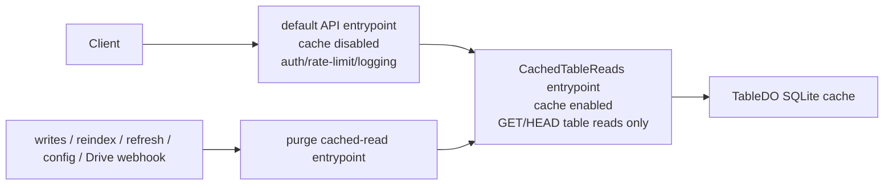

# Workers Cache Adoption Plan

## Goal

Adopt Cloudflare Workers Cache idiomatically and safely for Sheetflare read paths without weakening auth, rate limiting, table freshness, client cache safety, or operator observability.

Workers Cache must sit behind the API gateway logic, not in front of it. The default API entrypoint must continue to run on every external request so it can authenticate, authorize, rate limit, assign request IDs, apply CORS, and log request completion.

## Non-goals

- Do not enable Workers Cache globally on the current default API entrypoint.
- Do not cache admin/control-plane responses.
- Do not cache `/ready`.
- Do not add legacy `caches.default` cache-aside logic.
- Do not use Workers Cache as a replacement for `TableDO`'s SQLite cache.
- Do not cache mutation responses.
- Do not use client-visible `Cache-Control: public` for private/API-key table data.

## Reviewed Corrections

This plan was reviewed against the current Cloudflare Workers Cache documentation and the current Sheetflare API implementation. Important corrections from that review:

- Use `cloudflare-cdn-cache-control` or `cdn-cache-control` for edge-only caching of private/API-key read responses, not client-visible `Cache-Control: public`.
- Strip `Authorization` before forwarding to the cached entrypoint, or the inner cache will be `BYPASS` on authenticated requests.
- Do not cache errors by default; non-2xx responses from the cached entrypoint should carry `Cache-Control: no-store`.
- Include a table config version/signature in the cache key or `ctx.props`, so table/project config changes cannot be hidden by an old Workers Cache hit.
- Treat `cacheTtlSeconds = 0` as Workers Cache disabled for that table unless an explicit always-revalidate policy is designed.
- Cap or bypass Workers Cache while `TableDO` reports a pending external-change debounce, so an old edge response cannot outlive the debounce window.
- Do not cache request-specific headers from the inner entrypoint. The default gateway should add `x-request-id`, CORS, and rate-limit headers after the cached entrypoint returns.
- Account for purge rate limits before purging on every high-frequency mutation path.
- Confirm Hono access to the Cloudflare `ExecutionContext` through `c.executionCtx` and type access to `ctx.exports` before implementation.

## Expected Architecture

## Safety Rules

- The default API entrypoint stays uncached.
- Every cached response sets explicit edge cache directives.
- Private/API-key table data uses edge-only cache directives and client-visible `Cache-Control: private, no-store`.
- Public-read table data may use client-visible public caching only if that is an intentional API contract.
- Every cached table response has purgeable `Cache-Tag` values.
- Purges are called from the same entrypoint that owns cached responses.
- Private/authenticated external routes never return `Cache-Control: public` directly from the default entrypoint.
- The default gateway strips `Authorization` before forwarding requests to the cached entrypoint.
- If a cached response varies by caller, caller partitioning must move into `ctx.props` before caching.
- Query strings used for cache keys must be canonicalized before dispatch to the cached entrypoint.
- Config changes that can affect read behavior must change the cache key and purge affected entries.
- Worker cache TTL must align with operator-visible table freshness semantics.
- Error responses must be explicitly uncacheable unless a specific negative-cache contract is designed.
- Cached responses must not include request-specific headers such as stale `x-request-id` or rate-limit values.

## Phase 1 - Platform Prerequisites

- [x] Upgrade API deploy scripts from `npx wrangler@4.85.0` to a Wrangler version that supports per-entrypoint Workers Cache, currently documented as `4.107.0+`.
- [x] Update the API workspace `wrangler` dev dependency to the same supported range.
- [x] Update Cloudflare Workers types if needed for `WorkerEntrypoint`, `ctx.exports`, `ctx.cache.purge`, and `cloudflare:workers` imports.
- [x] Set the API Worker `compatibility_date` to a date compatible with Workers Cache usage.
- [x] Use top-level `cache.enabled = true` plus `exports.default.cache.enabled = false` when Phase 2 adds the cached entrypoint; keep cache config absent until then so staging and production stay uncached.
- [x] Keep staging uncached until the first end-to-end cache validation passes.
- [x] Document that default Workers Cache keying is versioned, so deploys cold-start cached responses unless `cross_version_cache` is later enabled.
- [x] Keep `cross_version_cache` disabled initially.

## Phase 2 - Entrypoint Boundary

- [x] Add a named `CachedTableReads` Worker entrypoint to the API Worker.
- [x] Configure `apps/api/wrangler.jsonc` so the default entrypoint cache is disabled.
- [x] Enable cache only for `CachedTableReads` in the `exports` map.
- [x] Keep the existing Hono app as the default exported API gateway.
- [x] Confirm current Workers types expose `cache` on `ExecutionContext` but do not expose `ctx.exports`; Phase 3 must use the typed `cloudflare:workers` exports surface or add an explicit wrapper before routing through the cached entrypoint.
- [x] Ensure `CachedTableReads` is invoked only through internal Worker-entrypoint calls, not as a new public unauthenticated route surface.
- [x] Ensure custom RPC invalidation methods on `CachedTableReads` call `this.ctx.cache.purge(...)` so purges apply to the cached-read entrypoint, not the default entrypoint.
- [x] Keep custom RPC methods for invalidation only; cacheable work itself must be exposed through `fetch()` because Workers Cache does not cache custom RPC method calls.

## Phase 3 - Cacheable Read Contract

- [x] Define internal cached-read request paths for list rows, get row, and get schema.
- [x] Route `GET /v1/projects/{project}/tables/{table}/rows` through `CachedTableReads` only after existing auth, project-boundary checks, public-read checks, and table access loading succeed.
- [x] Route `GET /v1/projects/{project}/tables/{table}/rows/{id}` through `CachedTableReads` only after existing auth and authorization checks succeed.
- [x] Route `GET /v1/projects/{project}/tables/{table}/schema` through `CachedTableReads` only after existing auth and authorization checks succeed.
- [x] Decide and test explicit `HEAD` behavior; Workers Cache shares `GET` and `HEAD` entries and may populate a full `GET` response for a cold `HEAD` request.
- [x] Preserve current error behavior for auth failures, disabled reads, missing projects, missing tables, unsupported queries, and missing rows.
- [x] Preserve current response schemas for list rows, get row, and schema responses.
- [x] Centralize JSON/error serialization so the cached entrypoint cannot drift from existing API error shape.
- [x] Keep mutation routes on the default entrypoint only.
- [x] Strip `Authorization` and any other automatic-bypass request headers before calling the cached `CachedTableReads` entrypoint.

## Phase 4 - Cache Key and Config Partitioning

- [x] Canonicalize list-row query strings before calling `CachedTableReads`.
- [x] Sort query parameters deterministically.
- [x] Omit or normalize default query values consistently; current list-row query has no implicit defaults, so absent values stay absent.
- [x] Preserve every query component that changes semantics.
- [x] Include project slug and table slug in the internal cached-read path.
- [x] Include row ID in the point-read path.
- [x] Include a table config version in the key, derived from a stable signature of the loaded project/table config and resolved runtime config.
- [x] Include the public/private auth mode in the key so a project auth-mode change cannot reuse a response with the wrong client cache headers.
- [x] Use `cf.cacheKey` on the `CachedTableReads.fetch(...)` loopback call for explicit canonical partitioning.
- [x] Avoid `ctx.props` for Phase 4 because the required partitions fit in `cf.cacheKey`; future caller-specific data must still account for `ctx.props` being part of the Workers Cache key.
- [x] Do not rely on hostname for cache partitioning; Workers Cache does not include host in the cache key.
- [x] Do not put credentials, bearer tokens, raw API keys, or secret material in the key, URL, tags, or props.
- [x] Add tests proving semantically identical query parameter order maps to one cached key when canonicalized.
- [x] Add tests proving table/project config changes produce a different key or trigger a purge before old entries can be reused.

## Phase 5 - Response Headers and Client Cache Safety

- [x] Set explicit edge cache directives on every successful cached table-read response.
- [x] For private/API-key reads, use `cloudflare-cdn-cache-control: public, max-age=<effectiveTtl>, stale-if-error=0` for Workers Cache, and send client-visible `Cache-Control: private, no-store`.
- [x] For anonymous `public-read` reads, keep client-visible `Cache-Control: private, no-store`; only the internal cached entrypoint carries edge-only cache directives.
- [x] Use `max-age=<effectiveTtl>` for the edge freshness window.
- [x] Compute `effectiveTtl` from `table.cacheTtlSeconds`, current `TableDO` freshness state, and any external-change debounce deadline.
- [x] Treat `cacheTtlSeconds = 0` as `no-store` for Workers Cache unless a separate always-revalidate design is approved.
- [x] If `TableDO` reports an external-change pending with a future `debounceUntil`, cap `effectiveTtl` to the remaining debounce window or bypass Workers Cache for that response.
- [x] If `TableDO` reports stale state that should trigger synchronous refresh, do not cache the stale response beyond the intended current request.
- [x] Do not add `stale-while-revalidate`; serving stale cached reads needs a separate explicit policy.
- [x] Do not combine `s-maxage`, `must-revalidate`, or `proxy-revalidate` with `stale-while-revalidate`; Cloudflare documents that those directives disable stale serving.
- [x] Set `stale-if-error=0` unless a bounded stale-on-error policy is explicitly chosen and documented.
- [x] Add `Cache-Tag: project:<project>,table:<project>:<table>` to list and schema responses.
- [x] Add `Cache-Tag: project:<project>,table:<project>:<table>,row:<project>:<table>:<id>` to point-read responses.
- [x] Ensure tag values are printable ASCII and short enough for Cloudflare tag limits.
- [x] Validate tag construction because Cloudflare silently drops invalid tags at storage time.
- [x] Do not emit `Set-Cookie` on cached read responses.
- [x] Add `Vary` only for request headers that actually affect representation.
- [x] If `Vary` is used, normalize the varied request headers in the gateway to avoid unbounded variant fan-out.
- [x] Never use `Vary: *`; it disables caching.
- [x] Do not cache inner-entrypoint responses with `x-request-id`, `x-ratelimit-*`, or per-request CORS values; those are default-gateway response concerns.
- [x] Add explicit `Cache-Control: no-store` to every non-2xx response produced by the cached entrypoint.

## Phase 6 - Purge Contract

- [x] Add `CachedTableReads.invalidateProject(projectSlug)` for project-wide config/external-change invalidation.
- [x] Add `CachedTableReads.invalidateTable(projectSlug, tableSlug)`.
- [x] Add `CachedTableReads.invalidateRow(projectSlug, tableSlug, rowId)` only as an optimization; table-level purge remains required for mutations.
- [x] Purge table cache after successful row create.
- [x] Purge table cache after successful row update.
- [x] Purge table cache after successful row delete.
- [x] Purge table cache after successful admin reindex.
- [x] Purge table cache after admin refresh when the pre-refresh table state is stale or not ready.
- [x] Purge table cache after table deletion so stale reads cannot survive table removal.
- [x] Purge the project tag after project deletion so every table cache in that project is invalidated.
- [x] Purge table cache after table config create/upsert when replacing an existing table.
- [x] Purge project cache after project config changes that can affect auth mode, credential resolution, spreadsheet identity, or table resolution.
- [x] Purge affected project cache and cap TTL for affected table cache when Google Drive notification records an external change.
- [x] For automatic external-change reindex/sync, rely on notification-time project purge plus debounce-capped TTL so interim cached entries expire at the debounce deadline.
- [x] Treat purge failures as operationally visible errors; do not silently continue as if cached reads are invalidated.
- [x] Check Cloudflare purge semantics before introducing per-mutation purge calls; use coarse project/table tags, not per-cell/per-query purges.
- [x] If write volume can exceed purge limits, prefer table-level short TTL, coalesced purges, or a documented degraded mode rather than silent best-effort invalidation.

## Phase 7 - Admin and System No-cache Policy

- [x] Keep `/ready` uncached.
- [x] Keep admin/control-plane routes uncached.
- [x] Keep API-key listing and creation routes uncached.
- [x] Keep Google Drive watch status, retry advice, registration, stop, and notification routes uncached.
- [x] Keep spreadsheet tab listing and inspection uncached unless a separate explicit admin cache policy is designed later.
- [x] Preserve `cache-control: no-store` in the admin Pages API proxy.
- [x] Add explicit no-store headers to dynamic default-entrypoint responses if default-entrypoint cache lookup is ever enabled for other reasons.
- [x] Do not cache 401/403 admin or data-route authorization failures.
- [x] Do not cache 404 table/project/row failures until negative caching and purge behavior are explicitly designed.

## Phase 8 - Optional Docs Cache

- [x] Decide `/doc` and `/docs` are not worth caching in this rollout.
- [x] Keep docs on the default entrypoint with `cache-control: no-store`.
- [x] Do not add a docs TTL until a separate explicit admin/docs cache policy is designed.
- [x] Rely on Worker deploys and default no-store behavior instead of cross-version docs cache reuse.
- [x] Keep docs behavior isolated from auth, readiness, and data-route caching behavior.
- [x] Do not enable cache lookup on the default gateway just to cache docs; Cloudflare documents this as extra latency when most responses are `no-store`.

## Phase 9 - Tests

- [x] Add route-level tests proving default API auth still runs before cached reads.
- [x] Add route-level tests proving default API rate limiting still runs before cached reads.
- [x] Add route-level tests proving private-table anonymous reads are rejected even when a cached entry exists internally.
- [x] Add route-level tests proving public-read anonymous reads can use cached responses safely.
- [x] Add tests proving API-key authorized reads do not expose cached private data to unauthorized callers.
- [x] Add tests proving forwarded cached-entrypoint requests strip `Authorization`.
- [x] Add tests for edge-only cache headers on private/API-key reads.
- [x] Add tests for client-visible cache headers on private/API-key reads.
- [x] Add tests for public-read cache headers.
- [x] Add tests for cache tags on list, point-read, and schema responses.
- [x] Add tests proving non-2xx cached-entrypoint responses are `no-store`.
- [x] Add tests for purge calls after create, update, delete, reindex, refresh, table delete, project delete, and config replacement.
- [x] Add tests for canonical query key generation.
- [x] Add tests for config-version key partitioning.
- [x] Add tests for `cacheTtlSeconds = 0` bypass behavior.
- [x] Add tests for pending external-change debounce TTL capping or bypass behavior.
- [x] Add tests for stale/config-change behavior so Workers Cache cannot bypass `TableDO` cache-signature correctness.
- [x] Add tests for purge failure handling.
- [x] Add tests confirming default gateway overwrites or appends fresh `x-request-id`, CORS, and rate-limit headers after a cached inner response.
- [x] Add tests for explicit `HEAD` behavior or explicit rejection.

## Phase 10 - Staging Verification

- [x] Deployable staging config keeps default entrypoint cache disabled and enables `CachedTableReads` cache.
- [ ] Deploy to staging with `CachedTableReads` enabled and default entrypoint disabled for cache.
  - 2026-07-07 session note: deploy attempt was blocked because Wrangler requires `CLOUDFLARE_API_TOKEN` in this non-interactive environment.
- [ ] Request the same public-read list endpoint twice and verify `Cf-Cache-Status` changes from `MISS` to `HIT` or documented equivalent behavior.
- [ ] Request the same private/API-key list endpoint twice and verify gateway auth still runs while the inner response can hit Workers Cache.
- [ ] Verify private/API-key responses are not browser/proxy-cacheable through client-visible headers.
- [ ] Verify private anonymous reads still return `401` or `403` and are not served from cache.
- [ ] Verify an API-key private read still succeeds after gateway auth.
- [ ] Mutate a row and verify the next matching read is not stale beyond the documented purge behavior.
- [ ] Reindex a table and verify cached list/schema responses are invalidated.
- [ ] Change table config and verify stale Workers Cache entries do not survive the change.
- [ ] Trigger or simulate a Drive external-change notification and verify stale edge responses do not outlive the debounce policy.
- [ ] Confirm request logs still appear for default gateway hits, including cached-read hits.
- [ ] Confirm rate-limit headers still appear on default gateway responses when applicable.
- [ ] Confirm `x-request-id` is fresh on default gateway responses and not cached from an old inner response.
- [ ] Confirm errors from the cached entrypoint are not cached.
- [ ] Confirm response sizes for cached list pages are below current Workers Cache limits.

## Phase 11 - Production Rollout

- [ ] Roll out with default Worker-version cache keying; do not enable `cross_version_cache` initially.
- [ ] Monitor `Cf-Cache-Status` on smoke/load traffic.
- [ ] Monitor Workers cache hit ratio, misses, bypasses, and updating responses in Workers Observability.
- [ ] Monitor TableDO request volume and API Worker CPU time before and after rollout.
- [ ] Monitor purge failures and purge rate-limit responses.
- [ ] Monitor stale response reports around Drive external-change notifications and table mutations.
- [ ] Keep a rollback path that disables the `CachedTableReads` entrypoint cache without changing table semantics.
- [ ] Do not enable `cross_version_cache` until deployment invalidation and version-tag purging are explicitly designed.

## Acceptance Criteria

- [ ] Default API entrypoint still runs for every external API request.
- [ ] Auth and rate limiting cannot be bypassed by a Workers Cache hit.
- [ ] Only GET/HEAD table read responses are cacheable.
- [ ] All cached table responses have explicit edge cache directives and `Cache-Tag` headers.
- [ ] Private/API-key responses are not client-cacheable unless a future explicit contract says otherwise.
- [ ] Mutations and config changes purge affected cached read responses or change their cache key before reuse.
- [ ] Public-read behavior remains correct before and after cached entries exist.
- [ ] Private-table behavior remains correct before and after cached entries exist.
- [ ] `cacheTtlSeconds` remains the operator-facing freshness contract.
- [ ] `cacheTtlSeconds = 0` does not accidentally create stale edge responses.
- [ ] Pending external-change debounce state cannot be hidden by a longer Workers Cache TTL.
- [ ] Non-2xx responses from cached read paths are not cached.
- [ ] Staging verification observes expected `Cf-Cache-Status` transitions.
- [ ] `npm run check` passes after implementation.

## References

- Cloudflare announcement: https://blog.cloudflare.com/workers-cache/
- Workers Cache overview: https://developers.cloudflare.com/workers/cache/
- Workers Cache configuration: https://developers.cloudflare.com/workers/cache/configuration/
- Workers Cache keys: https://developers.cloudflare.com/workers/cache/cache-keys/
- Workers Cache purge API: https://developers.cloudflare.com/workers/cache/purge/
- Workers Cache debugging: https://developers.cloudflare.com/workers/cache/debugging/
- Workers Cache examples: https://developers.cloudflare.com/workers/cache/examples/
- Workers Cache limitations: https://developers.cloudflare.com/workers/cache/limitations/
